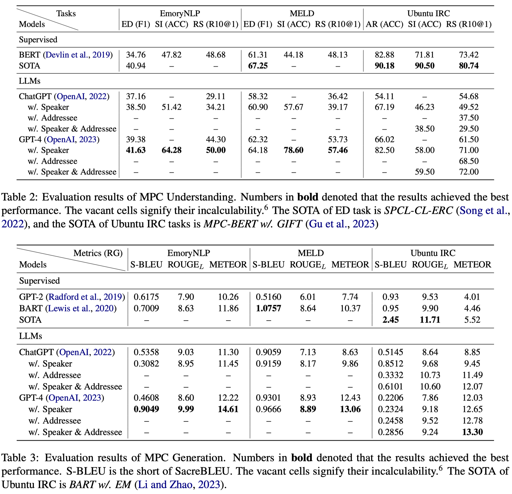

# Is ChatGPT a Good Multi-Party Conversation Solver?

This repository contains the source code for the _Findings of EMNLP 2023_ paper [Is ChatGPT a Good Multi-Party Conversation Solver?](https://arxiv.org/pdf/2310.16301v1.pdf). Chao-Hong Tan, Jia-Chen Gu, Zhen-Hua Ling. <br>


## Introduction
Large Language Models (LLMs) have emerged as influential instruments within the realm of natural language processing; nevertheless, their capacity to handle multi-party conversations (MPCs) -- a scenario marked by the presence of multiple interlocutors involved in intricate information exchanges -- remains uncharted. In this paper, we delve into the potential of generative LLMs such as ChatGPT and GPT-4 within the context of MPCs. An empirical analysis is conducted to assess the zero-shot learning capabilities of ChatGPT and GPT-4 by subjecting them to evaluation across three MPC datasets that encompass five representative tasks. The findings reveal that ChatGPT's performance on a number of evaluated MPC tasks leaves much to be desired, whilst GPT-4's results portend a promising future. Additionally, we endeavor to bolster performance through the incorporation of MPC structures, encompassing both speaker and addressee architecture. This study provides an exhaustive evaluation and analysis of applying generative LLMs to MPCs, casting a light upon the conception and creation of increasingly effective and robust MPC agents. Concurrently, this work underscores the challenges implicit in the utilization of LLMs for MPCs, such as deciphering graphical information flows and generating stylistically consistent responses.

<div align=center></div>

## Instruction

The requirements package is in `requirements.txt`.

Please refer to the shell file `run.sh`.

## Changelog & TODO

- [ ] Address the unsuccessful evaluation.

- [ ] Revise the cost estimate.

- [ ] Refactor the code.

Please keep an eye on this repository if you are interested in our work.
Feel free to contact us (chtan@mail.ustc.edu.cn) or open issues.

## Cite

```bibtex
@inproceedings{DBLP:journals/corr/abs-2310-16301,
  author       = {Chao{-}Hong Tan and
                  Jia{-}Chen Gu and
                  Zhen{-}Hua Ling},
  title        = {Is ChatGPT a Good Multi-Party Conversation Solver?},
  booktitle    = {Findings of the Association for Computational Linguistics: EMNLP 2023,
                  Singapore, Dec 6-10, 2023},
  publisher    = {Association for Computational Linguistics},
  year         = {2023},
}
```
